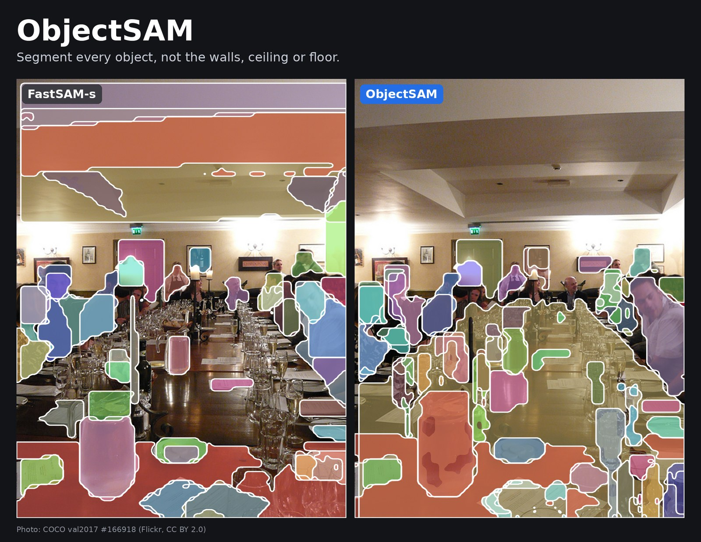

# ObjectSAM



**Segment every object in an image, but not the walls, ceiling or floor.**

ObjectSAM is a small, fast, class-agnostic instance segmentation model for robots and mapping. It is a YOLO26n-seg student distilled from FastSAM:

- **walls, ceilings and floors are background.** You get no masks on them;
- **doors, windows and stairs are still objects;**
- **one object gives one mask,** not a sofa in five pieces, and not a chair glued to its table;
- **it still finds things it was never told about.** There is no fixed class list. Every mask is just `object`, and you name it yourself, for example with CLIP/SigLIP on the mask crop.

It has 2.7 M parameters, about 1/10 of FastSAM-s's compute, and a 7 MB TensorRT engine, so it fits small robots (Jetson Nano/Orin) as well as desktop GPUs. Its outputs have the same shapes as FastSAM-s, so existing FastSAM post-processing works unchanged.

## Quick start

**1. Install and download**
```bash
git clone https://github.com/juyoung020/ObjectSAM && cd ObjectSAM
pip install ultralytics==8.4.171 onnxruntime opencv-python pillow
wget https://github.com/juyoung020/ObjectSAM/releases/download/v1.0/ObjectSAM-416.pt
wget https://github.com/juyoung020/ObjectSAM/releases/download/v1.0/ObjectSAM-416.onnx
```

**2. Run it (Python, Ultralytics)**
```python
from ultralytics import YOLO

model = YOLO("ObjectSAM-416.pt")
r = model("room.jpg", imgsz=416, conf=0.25, iou=0.7, retina_masks=True)[0]

masks = r.masks.data      # (N, H, W) one mask per object
boxes = r.boxes.xyxy      # (N, 4)
scores = r.boxes.conf     # (N,)
r.save("room_objects.jpg")
```
Always use `imgsz=416` and `conf=0.25`. The model is calibrated for that threshold.

**3. Without PyTorch (ONNX Runtime)**
```python
import sys; sys.path.insert(0, "tools")
import numpy as np
from PIL import Image
from ref_detect import OrtDetector

det = OrtDetector("ObjectSAM-416.onnx")
out = det.detect(np.asarray(Image.open("room.jpg").convert("RGB")))
print(len(out["score"]), "objects")
# out["score"] (N,), out["box"] (N, 4), out["masks"] (N, H, W) bool, out["grid"] masks on the 104x104 grid
```
`tools/ref_detect.py` is a plain numpy implementation of the full post-processing. Port it to your own runtime if you need to.

## Run it fast (TensorRT)

TensorRT engines depend on the GPU and the TensorRT version, so none are shipped. Build one on the machine that will run it.

```bash
# desktop GPU
python tools/build_engine.py ObjectSAM-416.onnx --out engines/

# Jetson Orin (JetPack 5.1+/6): FP16, or INT8 with the quantized ONNX
/usr/src/tensorrt/bin/trtexec --onnx=ObjectSAM-416.onnx --fp16 --saveEngine=objectsam_fp16.plan
/usr/src/tensorrt/bin/trtexec --onnx=ObjectSAM-416-int8-qdq.onnx --int8 --fp16 --saveEngine=objectsam_int8.plan

# Jetson Nano (JetPack 4.6, TensorRT 8.2): FP16 only, Nano has no fast INT8
/usr/src/tensorrt/bin/trtexec --onnx=ObjectSAM-416.onnx --fp16 --workspace=1024 --saveEngine=objectsam_fp16.plan
```
- **Speed** on an RTX 5070 Ti, TensorRT FP16 at 416:
  - 0.39 ms for the network;
  - 0.62 ms per frame including pre/post-processing (with a CUDA graph);
  - 48 MiB GPU memory.
- **Use a CUDA graph** (`trtexec --useCudaGraph` to measure, or capture the call in your code). At this size a frame is limited by kernel launches, and a graph cuts latency by about a third.
- **INT8** (`ObjectSAM-416-int8-qdq.onnx`, quantization scales included, no calibration needed on the device) is only worth trying on Jetson Orin. On a desktop GPU it was slower than FP16. Measure both on your device.
- The model outputs raw tensors with no NMS in the graph:
  - `output0` 1×37×3549: box, score, 32 mask coefficients;
  - `output1` 1×32×104×104: mask prototypes.

  Decode them like FastSAM/YOLOv8-seg: score > 0.25, NMS 0.7, mask = prototype logit > 0 inside the box. See `tools/ref_detect.py` for the exact steps.

## How much better than FastSAM?

Results on held-out simulated houses (robot-height camera, 10 unseen houses):

| | FastSAM-s | ObjectSAM |
|---|---|---|
| objects found | 0.793 | **0.803** |
| unseen categories found | 0.668 | **0.695** |
| false masks on wall/ceiling/floor, per frame | 4.44 | **1.55** (−65 %) |
| masks per object (lower = fewer fragments) | 2.77 | **2.51** |
| masks merging two objects, per frame | 1.66 | 1.69 |
| model size | 11.8 M params | **2.7 M params** |

- **Recall:** in no group (object size, doors/windows/stairs, categories never seen in training) is recall significantly lower than FastSAM-s's. The weakest group is doors/windows/stairs at −0.2 points (95 % CI [−3.0, +2.3]).
- **COCO and ADE20K:** recall is higher (COCO 0.530 vs 0.499, ADE20K 0.628 vs 0.581).
- Full tables are in [docs/TRAINING.md](docs/TRAINING.md).

## Things to know

- **Real photos.** The gain over FastSAM is biggest on robot-height indoor views. On real photos (COCO, ADE20K), wall/floor false masks are about the same as FastSAM's.
- **Masks are a bit conservative.** They hug the object, so whole-object IoU is somewhat lower than FastSAM's (0.633 vs 0.676 on the simulated houses).
- **Real video can give more masks.** The threshold was set to keep recall on simulator images. If you get too many masks on your camera, pick your own threshold with `tools/sweep_t.py` and bake it in with `tools/calibrate.py` (see [docs/TRAINING.md](docs/TRAINING.md)).
- **Parts stay with their object.** Clothes on a person and drawers in a cabinet are not separate masks, on purpose.
- **Tiny objects** (under about 32 × 32 px at 416 input) are still hard.
- **No class names.** Every mask is `object`. Name masks with an open-vocabulary model of your choice.

## Retrain or reproduce

[docs/TRAINING.md](docs/TRAINING.md) covers:
- how the labels were made (self-distillation from FastSAM-s plus whole-object ground truth);
- the data;
- the training recipe, including the under-segmentation penalty;
- score calibration;
- quantization;
- the step-by-step commands to rebuild everything from scratch.

The code is in `tools/`. Some code comments are in Korean.

## License

**AGPL-3.0** (see [LICENSE](LICENSE)). The model is trained from Ultralytics YOLO26n-seg weights, with labels from Ultralytics FastSAM-s, both AGPL-3.0. If you ship it in a networked product, AGPL obligations apply.

The weights were trained on COCO, LVIS, ADE20K and BEHAVIOR-1K renders. Some of these image sources are **non-commercial**, so treat the weights as **research-only**. This repository contains no dataset images and no BEHAVIOR assets.

| data | license / terms |
|---|---|
| COCO 2017, COCO-panoptic and LVIS v1 annotations | CC BY 4.0 |
| COCO images | Flickr terms, per-image Creative Commons (some non-commercial) |
| ADE20K images | MIT CSAIL: non-commercial research and education only |
| ADE20K annotations / tools | BSD-3-Clause |
| BEHAVIOR-1K scenes | BEHAVIOR dataset terms (non-commercial research) |

## Credits

- FastSAM: Zhao et al., *Fast Segment Anything*, 2023 (CASIA-IVA-Lab). The FastSAM-s weights are from Ultralytics.
- Ultralytics YOLO26 / YOLOv8 (AGPL-3.0).
- Data: COCO, LVIS, ADE20K, BEHAVIOR-1K / OmniGibson.
- Cover photo: COCO val2017 image 166918, from [Flickr](http://farm5.staticflickr.com/4117/4745624149_369a63786e_z.jpg), licensed [CC BY 2.0](http://creativecommons.org/licenses/by/2.0/). Masks overlaid; left FastSAM-s, right ObjectSAM, both at conf 0.25.
